#  meets FORGEROCK

## Setup IDP in FORGEROCK OpenAM
1. Login to OpenAM
2. Select Realm
3. Click "Configure SAMLv2 Provider" 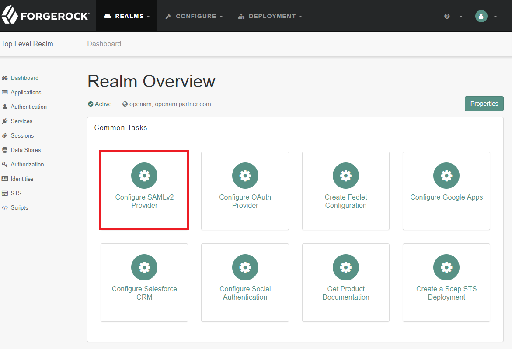
4. Click "Created Hosted Identity Provider" 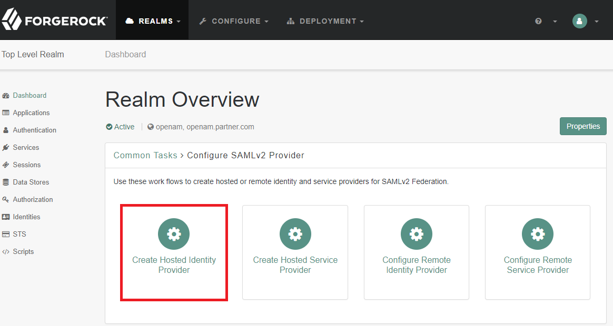
5. Setup IDP
    1. Give the IDP a name
    2. Assign a Signing key to the IDP
    3. Add IDP to a new circle of trust
    4. Add the following attribute mappings
        * cn -> cn
        * mail -> mail    
    5. Click Continue 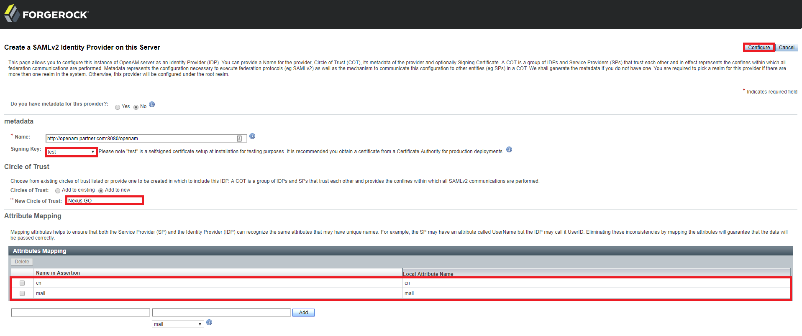
    6. Click Finish 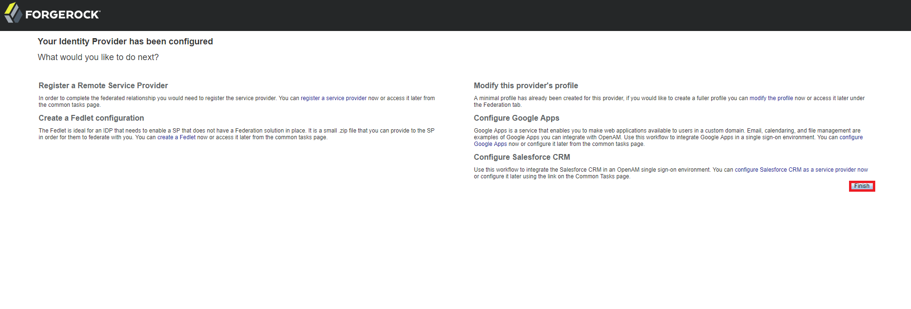
6. Download IDP metadata with URL https://<IdP_FQDN>/openam/saml2/jsp/exportmetadata.jsp?entityid=<name of IDP>

## Setup IDP in Nexus GO
1. Login to Nexus GO Portal
2. Click Services 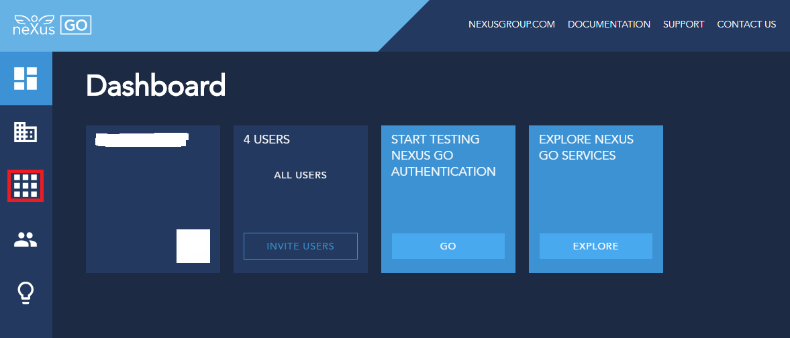
3. Click "Signing" 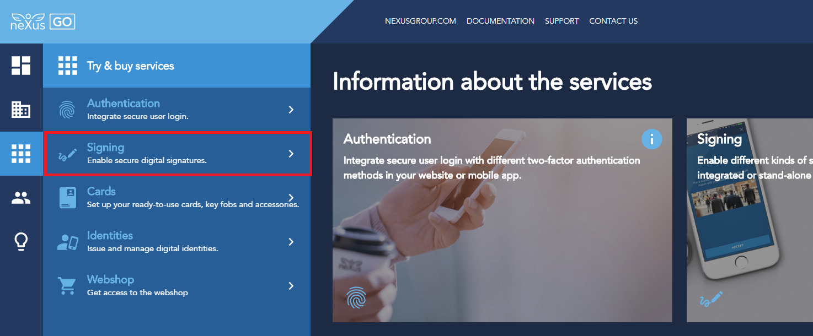
4. Select your signing service 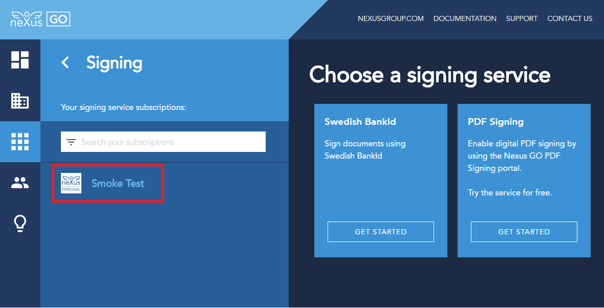
5. Click "Edit SAML IDP configuration" 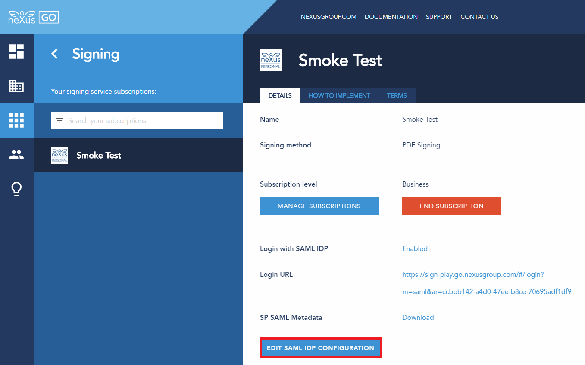
6. Set a display name 
7. Upload IDP metadata downloaded earlier
8. Click "NEXT" 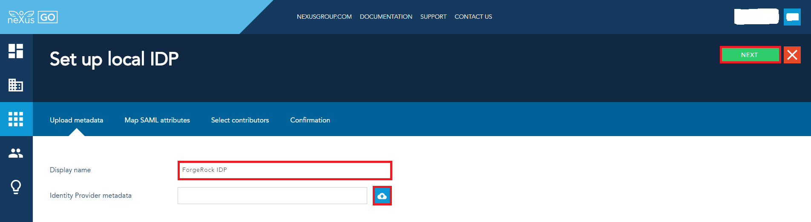
9. Add the following attribute mappings
    * email -> mail
    * displayName -> cn
10. Click "NEXT" 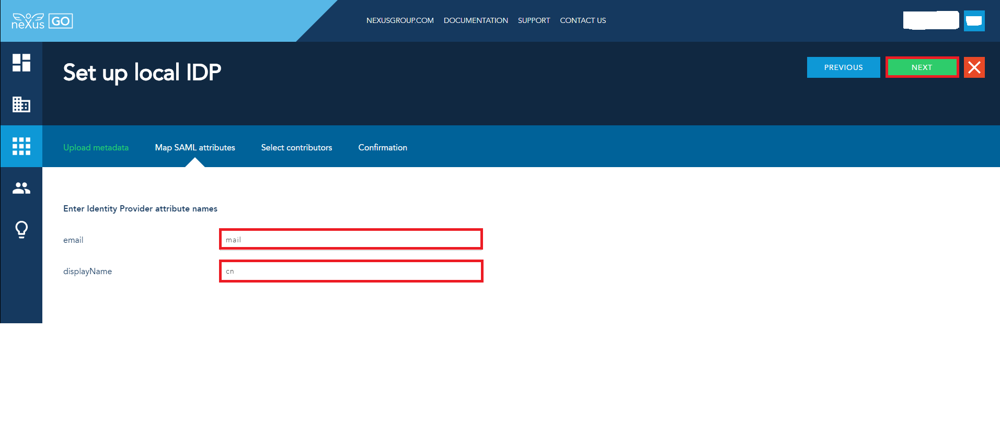
11. Allow evenryone from this Idendity Provider as contributors
12. Click "NEXT" 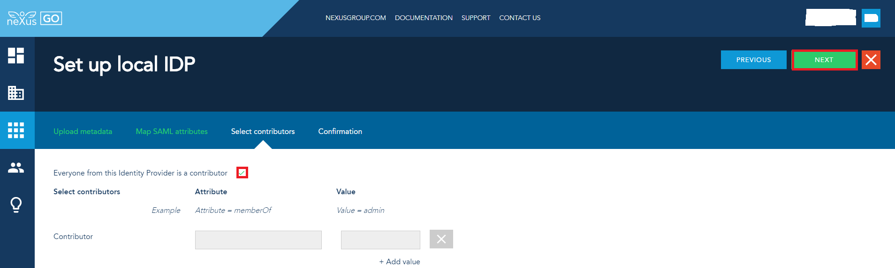
13. Click "SUBMIT" 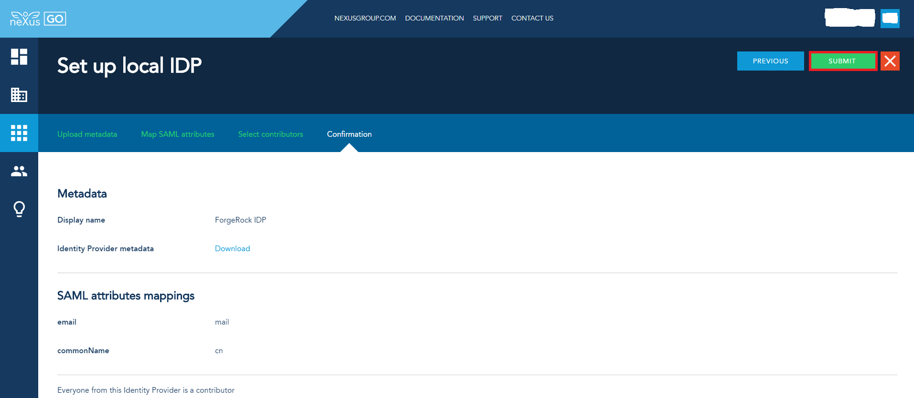
14. Download SP metadata 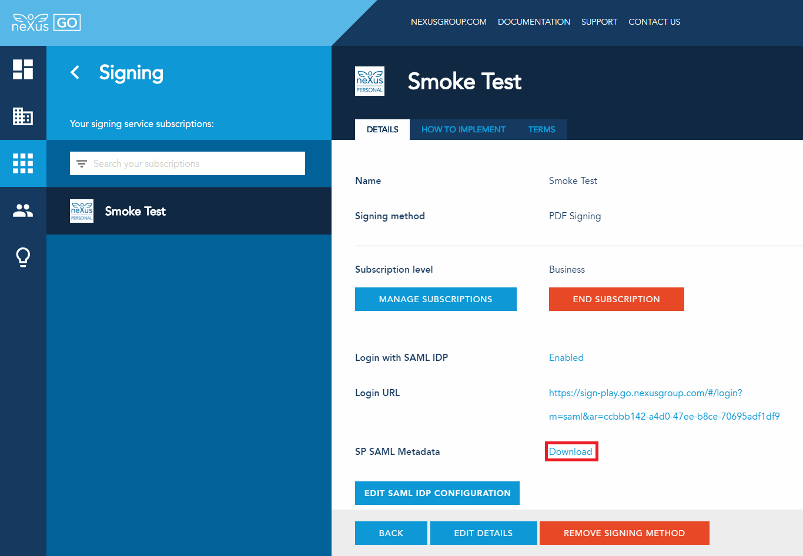
15. Copy Login URL

## Import SP into FORGEROCK OpenAM
1. Login to OpenAM
2. Select Realm
3. Click "Applications" 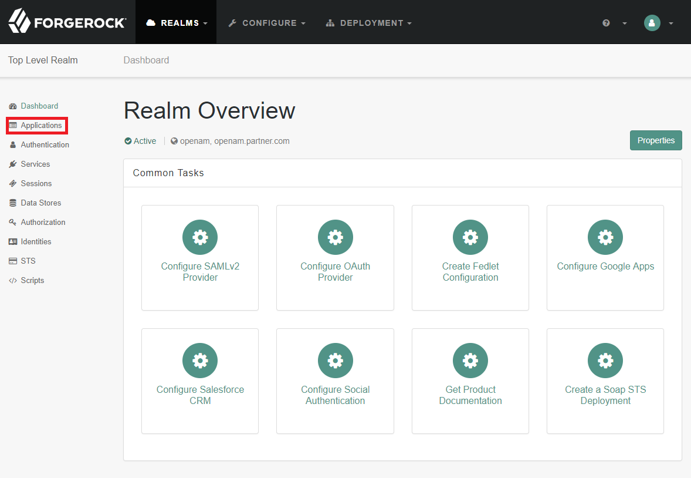
4. Click "Federation" 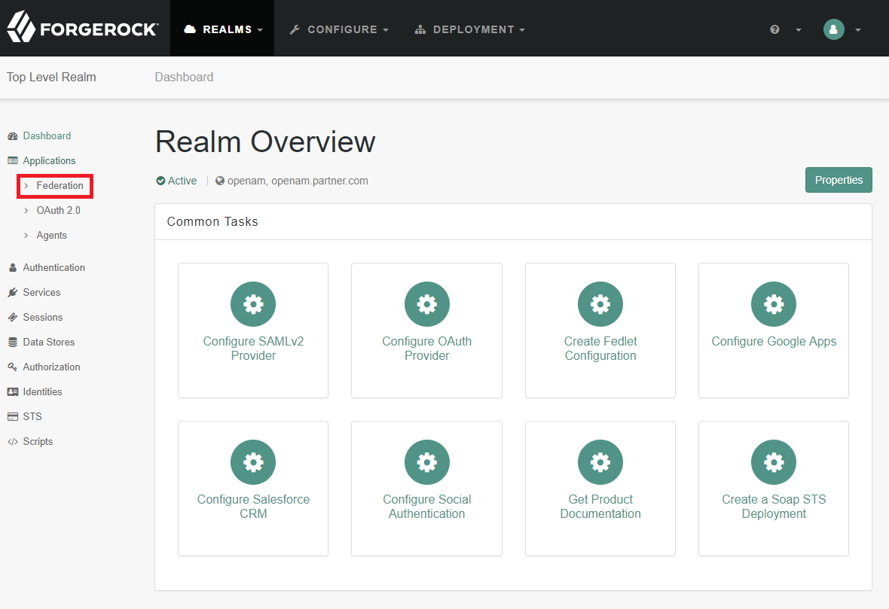
5. Click "Entity Provider" 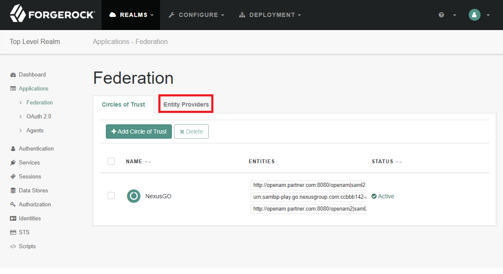
6. Import the SP metadata downloaded earlier 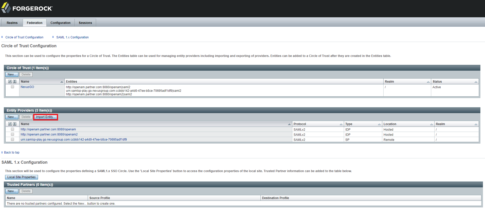 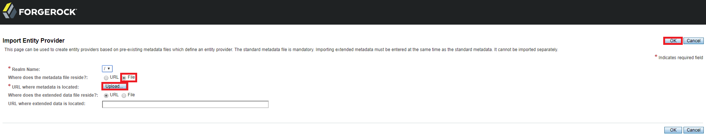

## Login to Nexus GO signing portal
1. Use link copied earlier 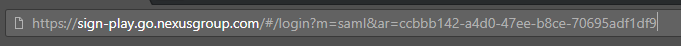
2. Use user credentials setup in FORGEROCK OpenAM 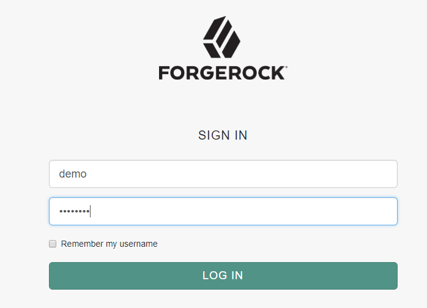
3. Start using the Nexus GO signing portal 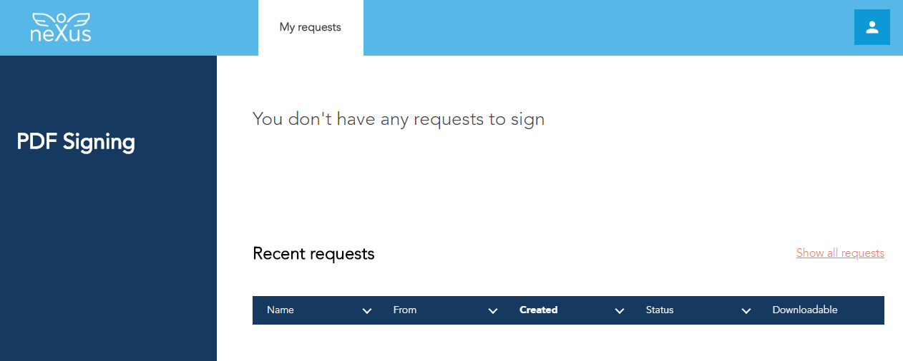

## Further reading
* For more information about Nexus GO please visit [Nexus online documentation](https://doc.nexusgroup.com)
* For more information about FORGEROCK please visit [FORGEROCK Backstage](https://backstage.forgerock.com)

